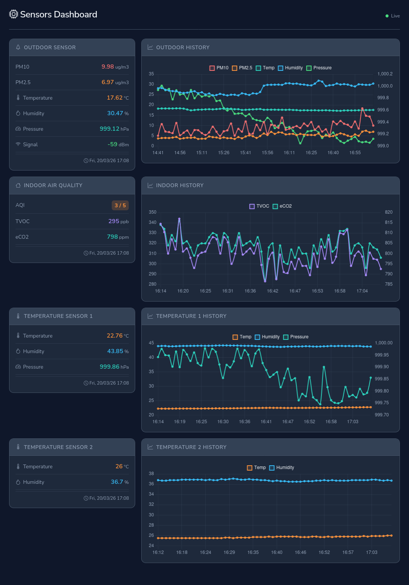

# Sensors

## Sensor Data Collection System

This repository contains a system for collecting and storing sensor data from various environmental sensors. The system
is designed to be modular, allowing for easy integration of new sensors and data sources.




## Architecture

The architecture of the system consists of these main components:

1. Clients
    1. **BME280 Sensor**: Reads temperature, humidity, and pressure data.
    2. **AM2302 Sensor**: Reads temperature and humidity data.
    3. **ENS160 Sensor**: Reads indoor air quality data (AQI, TVOC, eCO2).
    4. **AIRROHR**: Reads particulate matter (PM10, PM2.5) data.
2. Servers
    1. **API**: A Django REST API that receives data from the sensor clients and stores it in a database.
    2. **TimescaleDB**: A time-series database built on PostgreSQL for storing sensor data.
    3. **Redis**: Backs the Django Channels layer that pushes live readings to the browser.
3. Web Interface: Allows users to view sensor data in real-time.

## Clients

The clients read data from the sensors and send it to the server.
[Readme](clients/README.md) for more information.

## Servers

### API

Django REST API (based on DRF) that receives data from the sensor clients and stores it in a database.

### TimescaleDB

TimescaleDB is a time-series database built on PostgreSQL for storing sensor data.
Runs with docker on UNRAID server (`192.168.33.5:5432`).

### Redis

Redis backs the Django Channels layer, which broadcasts new readings to every
connected browser over WebSockets. Also runs on the UNRAID server
(`192.168.33.5:6379`).

That Redis instance is **shared with other apps**, so the channel layer is
pinned to its own database (`REDIS_DB`, default `1`) to keep its `asgi:*` keys
away from anything else. db 0 is already in use. Check what's taken before
changing it - only databases holding keys are listed:

```sh
redis-cli -h 192.168.33.5 info keyspace
```

## Web Interface

The web interface allows users to view sensor data in real-time. Readings arrive
over a WebSocket (`/ws/sensor_data/`), with a 30s HTTP poll as a fallback, and
the Live/1D/1W/1M/6M/1Y buttons switch the charts between live readings and
time-bucketed averages from `/api/history/`.

## Configuration

Everything is configured through environment variables. The defaults already
point at the UNRAID server, so no configuration is needed for a normal run.

| Variable | Default | Purpose |
|----------|---------|---------|
| `APP_PORT` | `4040` | Port uvicorn listens on (set as `ENV` in the Dockerfile) |
| `SECRET_KEY` | insecure scaffold key | Django secret key - **override outside of local dev** |
| `DB_HOST` | `192.168.33.5` | TimescaleDB host |
| `DB_PORT` | `5432` | TimescaleDB port |
| `DB_NAME` | `sensors` | Database name |
| `DB_USER` | `postgres` | Database user |
| `DB_PASSWORD` | `postgres` | Database password |
| `REDIS_HOST` | `192.168.33.5` | Redis host for the channel layer |
| `REDIS_PORT` | `6379` | Redis port |
| `REDIS_DB` | `1` | Redis database index - see [Redis](#redis) above |

`OPENWEATHERMAP_API_KEY` enables the outdoor weather and air pollution panels.
The views call `load_dotenv()` before reading it, so it can come from a `.env`
file in the project root or from a real environment variable (the environment
wins). Without it those two panels report a missing-key error and the rest of
the dashboard works normally.

> **Note:** `DEBUG` is currently hardcoded to `True` in `sensors/settings.py` and
> the `DEBUG` env var is ignored.

## Deployment

### Local development

```sh
uvicorn sensors.asgi:application --host 0.0.0.0 --port 4040 --reload --lifespan=off
```

Then open <http://localhost:4040>. Running uvicorn directly ignores `APP_PORT` -
pass `--port` yourself.

### Docker (standalone)

Build the image and run it. Every default is already correct for this setup, so
no environment variables are required:

```sh
docker build -t sensors:latest .
docker run -d --name sensors -p 4040:4040 sensors:latest
```

Overriding the configuration:

```sh
docker run -d --name sensors \
  -e APP_PORT=4040 \
  -e SECRET_KEY='<a real random key>' \
  -e DB_HOST=192.168.33.5 -e DB_PORT=5432 \
  -e DB_NAME=sensors -e DB_USER=postgres -e DB_PASSWORD=postgres \
  -e REDIS_HOST=192.168.33.5 -e REDIS_PORT=6379 -e REDIS_DB=1 \
  -p 4040:4040 sensors:latest
```

To serve on a different port, change `APP_PORT` and the `-p` mapping together
(`-e APP_PORT=8080 -p 8080:8080`), or keep the container port and remap only the
host side (`-p 9000:4040`).

Useful follow-ups:

```sh
docker logs -f sensors                  # tail the uvicorn log
docker exec -it sensors python manage.py migrate    # apply migrations
docker rm -f sensors                    # stop and remove
```

### k3s (Raspberry Pi cluster)
See [k8s/README.md](k8s/README.md) for the full deployment guide covering:
- Two RPi4 node cluster setup (k3s v1.34.5)
- Local image registry
- Redis channel layer for WebSocket scaling
- Traefik ingress with nip.io

## TODO

See [TODO.md](TODO.md).
